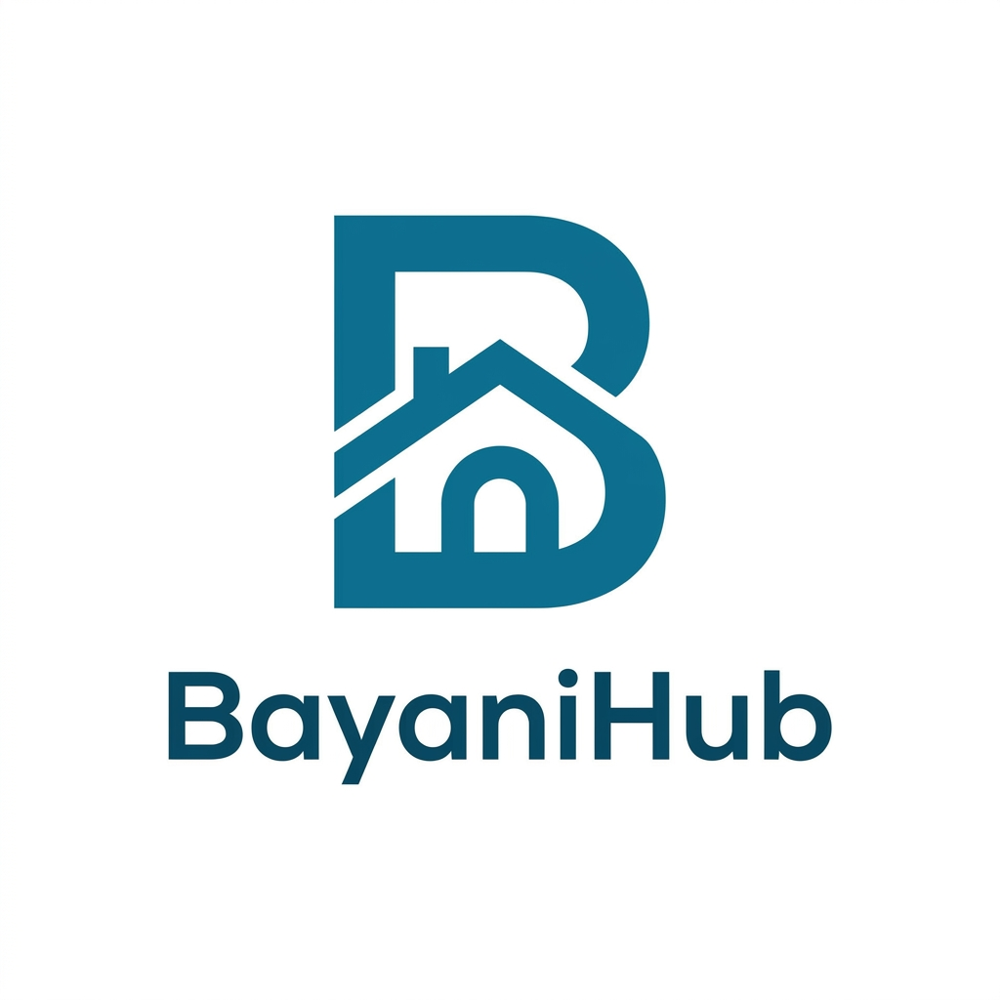

# 🌟 BayanihanHub

<div align="center">
  
  <br>
  <strong>Empowering the Heart of Cebu through Transparent, Accessible, and Community-Driven Digital Governance.</strong>
  <br><br>
  
  [](https://www.python.org/)
  [](https://flask.palletsprojects.com/)
  [](https://tailwindcss.com/)
  [](#)
</div>

---

## 📖 About The Project

**BayanihanHub** bridges the gap between citizens and their Local Government Units (LGUs). In many communities, reporting issues like broken streetlights, uncollected garbage, or potholes is a tedious process with zero transparency. 

We solve this by transforming passive residents into active community heroes. Through our platform, citizens can easily snap and report local issues. To drive massive user adoption, we introduced a **Gamification System** where users earn "Hero Points" for valid reports. These points can be redeemed for real-world goods (like rice, canned goods, or GCash) at the virtual **Bayanihan Sari-Sari Store**.

Meanwhile, the **Barangay Command Center** (Admin) receives a bird's-eye view of all incidents, allowing them to dispatch engineering or sanitation teams efficiently and maintain a public transparency ledger.

---

## ✨ Key Features

### 🧑‍🤝‍🧑 For Citizens (User Dashboard)
* **Snap & Report:** Instantly report community issues with Auto-GPS location detection and live photo uploads.
* **Bayanihan Sari-Sari Store:** Earn "Hero Points" for every verified report and redeem them for essential goods via digital vouchers.
* **Live Community Map:** See what's happening around your neighborhood in real-time.
* **Secure OTP Login:** Safe and verified user registration via Email OTP.
* **Community Feed:** Stay updated on public projects and community news verified by the LGU.

### 🏛️ For LGU Administrators (Command Center)
* **Incident Ledger:** Triage, verify, and resolve community tickets in a streamlined interface.
* **Live Dispatch Map:** Pinpoint exactly where action is needed and track pending vs. in-progress tasks.
* **Transparency Record:** A permanent public ledger of all resolved issues to build public trust.
* **Store Inventory Management:** Manage the rewards and stocks available for active citizens.
* **System Settings & Support:** Built-in bug reporting and account configurations.

---

## 💻 Tech Stack

This project was built with a **"Tech 4 Less"** and frugal innovation mindset, ensuring that LGUs with limited budgets can deploy this solution without expensive cloud dependencies.

* **Frontend:** HTML5, Tailwind CSS, Vanilla JavaScript
* **Backend:** Python, Flask (Werkzeug/Jinja2)
* **Database:** SQLite / SQLAlchemy (Production-ready for PostgreSQL migration)
* **Mapping/GIS:** Leaflet.js & OpenStreetMap (Free & Open Source)
* **Authentication:** Flask-Mail (Email OTP Verification)

---

## 🚀 How to Run Locally

Follow these steps to run BayanihanHub on your local machine:

**1. Clone the repository**
```bash
git clone [https://github.com/ZRayce/BayanihanHub_HACKUSC.git](https://github.com/ZRayce/BayanihanHub_HACKUSC.git)
cd BayanihanHub_HACKUSC

**2. Create a Virtual Environment**
```bash
python -m venv venv
source venv/Scripts/activate  # For Linux/Mac
venv\Scripts\activate         # For Windows

**3. Install Dependencies**
```bash
pip install -r requirements.txt

**4. Set up Environment Variables**
Create a .env file in the root directory (or export directly) for the Email OTP and Admin features:

Code snippet
MAIL_USERNAME=admin.bayanihanhub@cebu.gov.ph
MAIL_PASSWORD=your_16_character_app_password

**5. Run the Application**
```bash
python app.py
The app will run on http://127.0.0.1:5000

**🔑 Demo Credentials**
To access the Command Center during the demo:

Admin Email: admin.bayanihanhub@cebu.gov.ph

Admin Password: Bayanihan_Secure_2026!

**👥 Meet The Team**
We are a team of first-year students from the Department of Computer Information Sciences and Mathematics at the University of San Carlos, united by a passion for civic tech and community building.

Rayce Manuel E. Fillon
BS Information Technology - Year 1
📧 25104293@usc.edu.ph

Kris Andrie Ortega
BS Computer Science - Year 1
📧 25101270@usc.edu.ph

Christopher Michael O. Magadan
BS Information Systems - Year 1
📧 25102550@usc.edu.ph